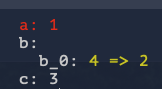

# JsonDiff library

The main purpose of the library is integration into tests which use json and providing human-readable output of test results.

The lib can compare two json items and return a detailed report of the comparison.

At the moment it can detect a couple of types of differences:

 - FullMatch - means items are identical.
 - SupersetMatch - means first item is a superset of a second item.
 - NoMatch - means objects are different.

Being a superset means that every object and array which don't match completely in a second item must be a subset of a first item. For example:

```json
{"a": 1, "b": 2, "c": 3}
```

Is a superset of (or second item is a subset of a first one):

```json
{"a": 1, "c": 3}
```

Library API documentation can be found on godoc.org: https://godoc.org/github.com/nsf/jsondiff

You can try **LIVE** version here (thanks to [gopherjs](https://github.com/gopherjs/gopherjs)): https://nosmileface.dev/jsondiff

The library is inspired by http://tlrobinson.net/projects/javascript-fun/jsondiff/

## YAML Output Support

This fork is based heavily on the original [jsondiff project](https://github.com/nsf/jsondiff). The main change from the original (apart from a refactor) is that this one supports YAML output!

Example:
```go
a := `{"a": 1, "b": {"b_0": 4}, "c": 3}`
b := `{"b": {"b_0": 2}, "c": 3}`

opts := jsondiff.DefaultConsoleOptions().WithYAMLOutput()

_, diff := jsondiff.Compare([]byte(a), []byte(b), &opts)

fmt.Println(diff)
```
will output the following:


